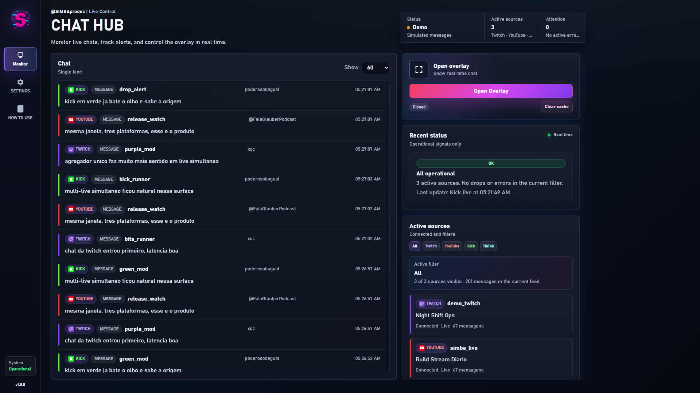
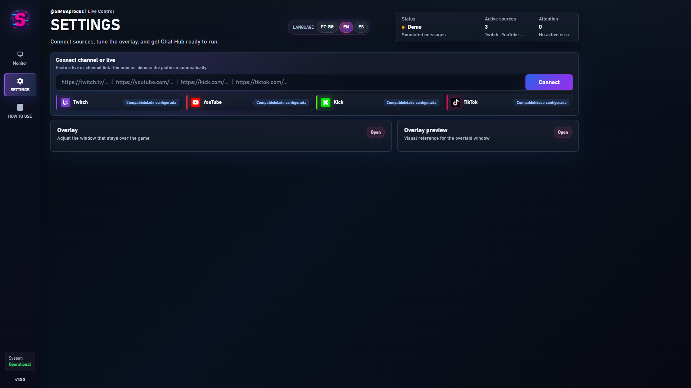
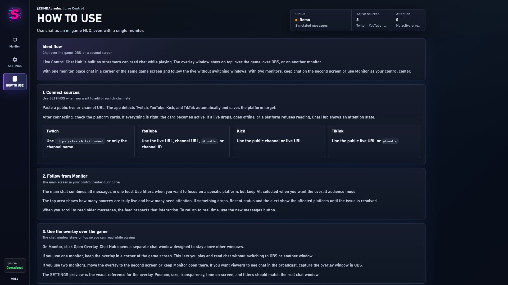

[//]: # (       __     __                   )
[//]: # (_|_   (_ ||\/|__) /\ _ _ _ _|   _  )
[//]: # ( |    __)||  |__)/--|_| (_(_||_|/_ )
[//]: # (                    |  )

<p align="center">
  
</p>

<h1 align="center">Live Control - CHAThub</h1>

<p align="center">
  A premium local dashboard that unifies Twitch, YouTube, Kick and TikTok live chats, with a real overlay window for streamers.
</p>

<p align="center">
  <a href="./README.md">Português</a>
  ·
  <a href="./README.es.md">Español</a>
  ·
  <a href="https://discord.simbaproduz.com">SIMBAproduz Discord</a>
</p>

## What It Is

**Live Control - CHAThub** is a local live chat control center. It runs on Windows as a desktop app and combines multiple live chat sources into one operational feed.

The overlay opens as a separate window designed to stay above the game, OBS, or another monitor.

## Features

- Unified chat for Twitch, YouTube, Kick and TikTok.
- Real always-on-top overlay window.
- Visual overlay preview.
- Platform and event filters.
- Smart source status, drop detection and reconnection visibility.
- Emote/media rendering when platforms provide media.
- Premium dark dashboard UI.
- Interface languages: PT-BR, EN and ES.
- Local persistent configuration.

## Screenshots







## Quick Start

Desktop app:

```bash
npm install
npm run desktop
```

Local browser server:

```bash
npm install
npm start
```

Open:

```text
http://127.0.0.1:4310
```

## Overlay

The overlay is a separate local window. You can use it on top of a game with one monitor, or place it on a second screen.

You can tune monitor target, corner, font size, opacity, card width, message duration and filters.

## Desktop Build

The desktop app uses Electron to open **CHAT HUB** in its own window, with a custom titlebar, `simba.ico` icon and local runtime started automatically.

```bash
npm run build:desktop
```

Generated artifacts are written to:

```text
output/desktop/
```

Generated `.exe` files, logs, caches and build output do not belong in Git. Release binaries should be published through **GitHub Releases**.

## Privacy

Private local state belongs in:

```text
runtime/monitor-config.local.json
```

This file is ignored by Git. Do not publish tokens, logs or local operator data.

## License

MIT. See [LICENSE](LICENSE).
