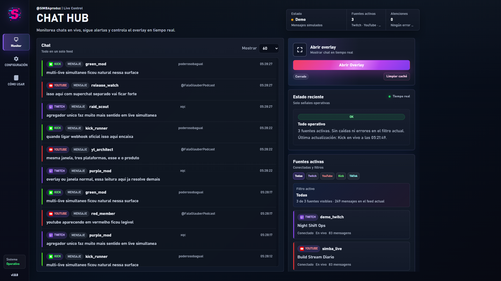
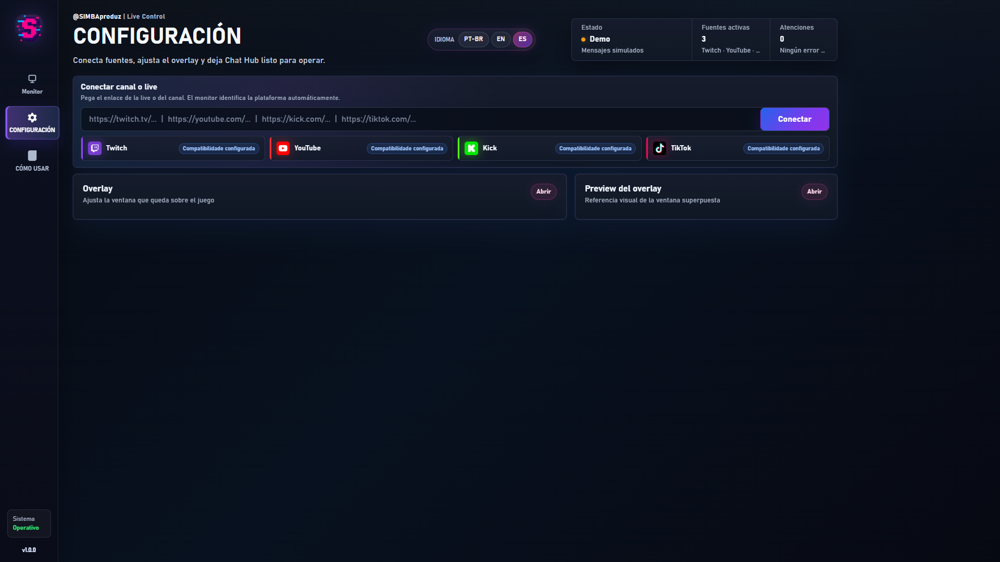
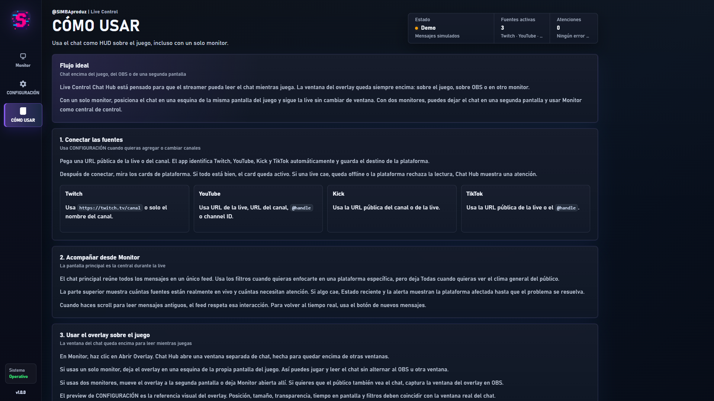

[//]: # (       __     __                   )
[//]: # (_|_   (_ ||\/|__) /\ _ _ _ _|   _  )
[//]: # ( |    __)||  |__)/--|_| (_(_||_|/_ )
[//]: # (                    |  )

<p align="center">
  
</p>

<h1 align="center">Live Control - CHAThub</h1>

<p align="center">
  Un dashboard local premium que une chats en vivo de Twitch, YouTube, Kick y TikTok, con una ventana real de overlay para streamers.
</p>

<p align="center">
  <a href="./README.md">Português</a>
  ·
  <a href="./README.en.md">English</a>
  ·
  <a href="https://discord.simbaproduz.com">Discord SIMBAproduz</a>
</p>

## Descarga para usar

Si solo quieres abrir CHAT HUB, entra en **Releases** y descarga uno de estos archivos:

- `CHAT-HUB-1.0.2-Windows-x64.exe`
- `CHAT-HUB-1.0.2-USUARIO-FINAL.zip`

El camino más simple es descargar el `.exe` y abrirlo con doble clic. Si el navegador o antivirus bloquea el `.exe`, descarga el ZIP `USUARIO-FINAL`, extrae la carpeta y abre el `.exe` que está dentro.

| Archivo | Para quién es | Qué hacer |
| --- | --- | --- |
| `CHAT-HUB-1.0.2-Windows-x64.exe` | Usuario normal | Descargar y abrir. |
| `CHAT-HUB-1.0.2-USUARIO-FINAL.zip` | Usuario normal que prefiere ZIP | Extraer primero y luego abrir el `.exe`. |
| `Source code.zip` | Desarrollador | No lo uses para instalar la app. |
| `Source code.tar.gz` | Desarrollador | No lo uses para instalar la app. |

Importante: el botón verde **Code** de GitHub descarga código fuente. No instala la app. Para usar CHAT HUB, usa siempre los archivos de **Releases**.

## Qué es

**Live Control - CHAThub** es una central local de chat para lives. Corre en Windows como app de escritorio y combina múltiples fuentes de chat en un único feed operativo.

El overlay abre una ventana separada, pensada para quedar encima del juego, OBS u otro monitor.

## Recursos

- Chat unificado para Twitch, YouTube, Kick y TikTok.
- Ventana real de overlay siempre encima.
- Preview visual del overlay.
- Filtros por plataforma y tipo de evento.
- Estado inteligente de fuentes, caídas y reconexiones.
- Emotes/media cuando la plataforma los entrega.
- Interfaz dark premium.
- Idiomas: PT-BR, EN y ES.
- Configuración persistente local.
- Cierre completo con X: la app, el servidor local y el overlay se cierran juntos.

## Screenshots







## Inicio rápido

### Para usuarios

1. Descarga `CHAT-HUB-1.0.2-Windows-x64.exe` o `CHAT-HUB-1.0.2-USUARIO-FINAL.zip`.
2. Si descargaste el ZIP, extrae la carpeta antes de abrir.
3. Abre `CHAT-HUB-1.0.2-Windows-x64.exe`.
4. Si Windows muestra una alerta de seguridad, elige **Más información** y luego **Ejecutar de todos modos**.
5. Para cerrar, haz clic en la **X** de la app. Esto también detiene el servidor local y el overlay.

No necesitas Node.js, npm ni instalar bibliotecas.

### Si descargaste el archivo equivocado

Si descargaste `Source code.zip`, `Source code.tar.gz` o usaste el botón verde **Code**, borra ese archivo y descarga el `.exe` o el ZIP `USUARIO-FINAL` desde la página de release. El código fuente necesita Node.js y bibliotecas, por eso no es el paquete correcto para usuarios no técnicos.

### Para desarrolladores

App de escritorio:

```bash
npm install
npm run desktop
```

Servidor local en navegador:

```bash
npm install
npm start
```

Abre:

```text
http://127.0.0.1:4310
```

## Overlay

El overlay es una ventana local separada. Puede quedar encima del juego en un solo monitor o ir a una segunda pantalla.

Puedes ajustar monitor, esquina, tamaño de fuente, opacidad, ancho del card, duración de mensajes y filtros.

## Build de escritorio

El app de escritorio usa Electron para abrir **CHAT HUB** en una ventana propia, con titlebar custom, ícono `simba.ico` y runtime local iniciado automáticamente.

```bash
npm run package:release
```

Los artefactos para usuarios salen en:

```text
output/release/CHAT-HUB-1.0.2-Windows-x64.exe
output/release/CHAT-HUB-1.0.2-USUARIO-FINAL.zip
```

Usa `npm run package:source-dev` solo cuando necesites un ZIP de código para desarrolladores. Los `.exe`, logs, cachés y builds generados no van en Git. Los binarios finales deben publicarse en **GitHub Releases**.

## Privacidad

El estado privado local queda en:

```text
runtime/monitor-config.local.json
```

Este archivo está ignorado por Git. No publiques tokens, logs ni datos locales del operador.

## Licencia

MIT. Consulta [LICENSE](LICENSE).
