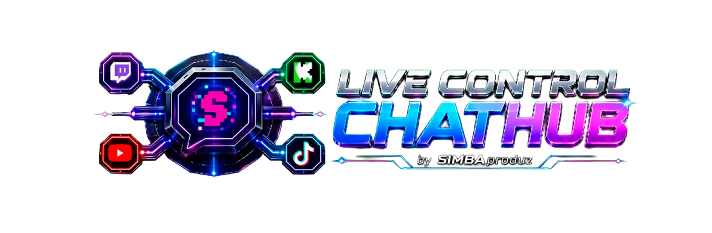
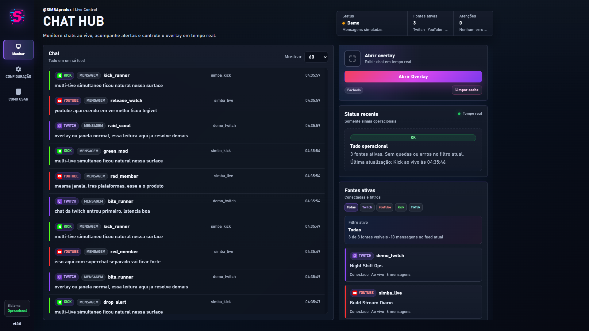
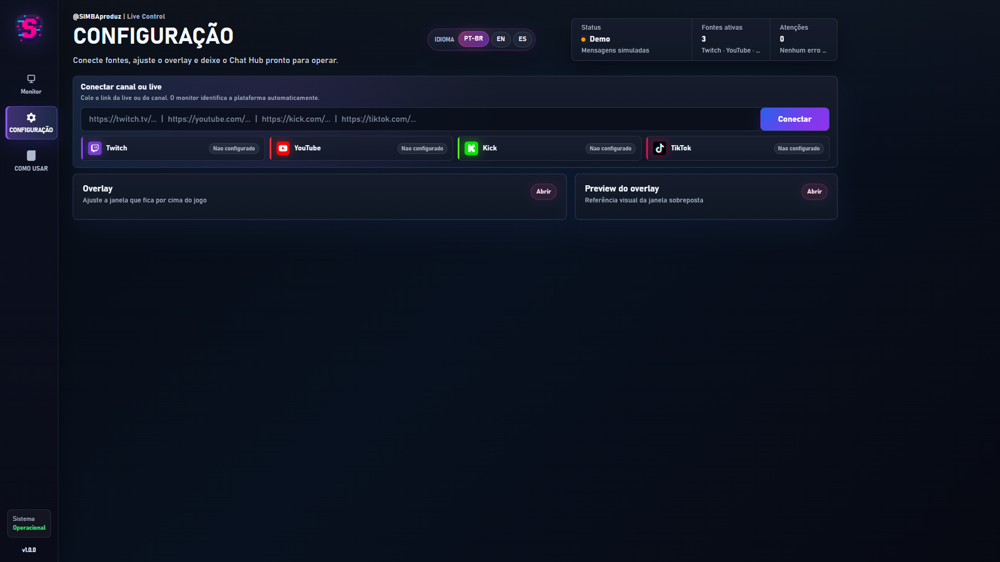
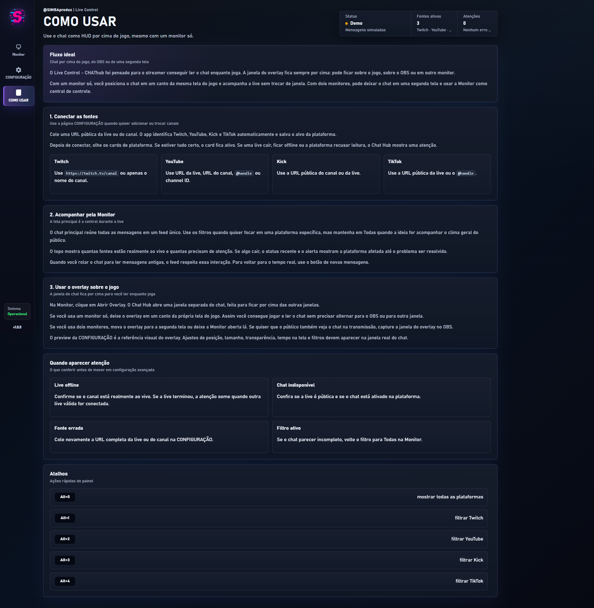

[//]: # (       __     __                   )
[//]: # (_|_   (_ ||\/|__) /\ _ _ _ _|   _  )
[//]: # ( |    __)||  |__)/--|_| (_(_||_|/_ )
[//]: # (                    |  )

<p align="center">
  
</p>

<h1 align="center">Live Control - CHAThub</h1>

<p align="center">
  Um painel local premium para unir chats ao vivo de Twitch, YouTube, Kick e TikTok, com overlay real para streamers acompanharem tudo sem trocar de tela.
</p>

<p align="center">
  <a href="./README.en.md">English</a>
  ·
  <a href="./README.es.md">Español</a>
  ·
  <a href="https://discord.simbaproduz.com">Discord SIMBAproduz</a>
</p>

<p align="center">
  
  
  
  
  <a href="https://discord.simbaproduz.com"></a>
</p>

<p align="center">
  
  
  
  
</p>

## Download para usar

Se você só quer abrir o CHAT HUB, vá em **Releases** e baixe um destes arquivos:

- `CHAT-HUB-1.0.2-Windows-x64.exe`
- `CHAT-HUB-1.0.2-USUARIO-FINAL.zip`

O caminho mais simples é baixar o `.exe` e abrir com dois cliques. Se o navegador ou antivírus bloquear o `.exe`, baixe o ZIP `USUARIO-FINAL`, extraia a pasta e abra o `.exe` que está dentro.

| Arquivo | Para quem é | O que fazer |
| --- | --- | --- |
| `CHAT-HUB-1.0.2-Windows-x64.exe` | Usuário normal | Baixar e abrir. |
| `CHAT-HUB-1.0.2-USUARIO-FINAL.zip` | Usuário normal que prefere ZIP | Extrair primeiro, depois abrir o `.exe`. |
| `Source code.zip` | Desenvolvedor | Não use para instalar. |
| `Source code.tar.gz` | Desenvolvedor | Não use para instalar. |

Importante: o botão verde **Code** do GitHub baixa código-fonte. Ele não instala o app. Para usar o CHAT HUB, use sempre os arquivos da área **Releases**.

## O que é

**Live Control - CHAThub** é uma central local de chat para lives. A aplicação roda no seu Windows, abre como app desktop e conecta múltiplas plataformas em um único feed operacional.

O objetivo é simples: permitir que o streamer leia o chat em tempo real enquanto joga, transmite ou opera o OBS. O overlay abre em uma janela separada, feita para ficar por cima do jogo, por cima do OBS ou em outro monitor.

## Recursos

- Chat unificado para Twitch, YouTube, Kick e TikTok.
- Overlay real com janela separada sempre por cima.
- Preview visual do overlay antes de salvar.
- Filtros por plataforma e por tipo de evento.
- Status inteligente de fontes ativas, quedas, erros e reconexões.
- Emotes e imagens de chat renderizados quando a plataforma fornece mídia.
- Interface dark premium com sidebar, cards compactos e fluxo operacional.
- Idiomas de interface: PT-BR, EN e ES.
- Configuração local persistente, sem enviar credenciais para servidor externo.
- Fechamento completo pelo X: app, servidor local e overlay encerram juntos.
- Testes locais de replay e regressão de status.

## Plataformas suportadas

| Plataforma | Status | Observação |
| --- | --- | --- |
| Twitch | Suportada | Canal público, chat ao vivo e emotes quando disponíveis. |
| YouTube | Suportada | Compatibilidade pública primeiro, fallback oficial opcional com credencial local. |
| Kick | Suportada | Canal público e eventos de chat ao vivo. |
| TikTok | Suportada | Leitura por URL pública da live ou `@handle`. |

## Screenshots

### Monitor



### Configuração



### Como usar



## Como usar

### Requisitos para usuários

- Windows 10 ou Windows 11.
- PowerShell disponível no sistema.
- Lives públicas nas plataformas que você deseja conectar.
- Não precisa instalar Node.js, npm nem bibliotecas.

### Abrir o app

1. Baixe `CHAT-HUB-1.0.2-Windows-x64.exe` ou `CHAT-HUB-1.0.2-USUARIO-FINAL.zip`.
2. Se baixou o ZIP, extraia a pasta antes de abrir.
3. Abra o executável `CHAT-HUB-1.0.2-Windows-x64.exe`.
4. Se o Windows mostrar aviso de segurança, clique em **Mais informações** e depois em **Executar assim mesmo**.
5. Para fechar, clique no **X** do app. Isso também finaliza o servidor local e o overlay.

### Se você baixou o arquivo errado

Se você baixou `Source code.zip`, `Source code.tar.gz` ou usou o botão verde **Code**, apague esse arquivo e baixe o `.exe` ou o ZIP `USUARIO-FINAL` na página de release. O código-fonte precisa de Node.js e bibliotecas, por isso não é o pacote certo para usuário leigo.

### Desenvolvimento local

Esta parte é só para quem quer mexer no código.

Para abrir como app desktop durante o desenvolvimento:

```bash
npm install
npm run desktop
```

Para rodar como servidor local no navegador:

```bash
npm install
npm start
```

Depois abra:

```text
http://127.0.0.1:4310
```

Também existe um atalho local:

```text
start-live-control-chathub.cmd
```

Esse atalho tenta instalar dependências automaticamente quando alguém baixou o ZIP de código, mas o caminho recomendado para usuário final continua sendo o `.exe`.

### Fluxo recomendado

1. Abra **CONFIGURAÇÃO**.
2. Cole a URL da live, canal ou `@handle`.
3. Confirme os cards de plataforma.
4. Volte para **Monitor** para acompanhar o chat unificado.
5. Clique em **Abrir Overlay** quando quiser o chat por cima do jogo/OBS.
6. Ajuste posição, tamanho, transparência e filtros em **CONFIGURAÇÃO**.

## Configuração do overlay

O overlay é uma janela local independente. Ele pode ser usado em um único monitor, sobreposto ao jogo, ou em uma segunda tela.

Você pode configurar:

- monitor de destino;
- canto da tela;
- tamanho da fonte;
- tempo de permanência das mensagens;
- transparência do fundo;
- largura do card;
- filtros por plataforma;
- filtros por mensagens, entradas, audiência e eventos técnicos.

O preview da página **CONFIGURAÇÃO** é a referência visual do overlay real.

## Idiomas

A interface suporta:

- Português do Brasil;
- English;
- Español.

A troca é instantânea dentro do app e fica salva localmente.

## Privacidade

O app roda localmente. Configurações privadas do operador ficam em:

```text
runtime/monitor-config.local.json
```

Esse arquivo é ignorado pelo Git. Credenciais, tokens, logs e histórico local não devem ser publicados.

## Scripts

```bash
npm start
npm run desktop
npm run build:desktop
npm run check:status
npm run check:replay
npm run package:release
npm run package:source-dev
```

## Build desktop

O app desktop usa Electron para abrir o **CHAT HUB** em janela própria, com titlebar custom, ícone `simba.ico` e runtime local iniciado automaticamente.

```bash
npm run package:release
```

Os artefatos para usuário final saem em:

```text
output/release/CHAT-HUB-1.0.2-Windows-x64.exe
output/release/CHAT-HUB-1.0.2-USUARIO-FINAL.zip
```

Use `npm run package:source-dev` apenas quando precisar gerar um ZIP de código para desenvolvedores. Arquivos `.exe`, logs, cache e builds gerados não entram no Git. O executável final deve ser publicado em **GitHub Releases**, não versionado no código-fonte.

## Roadmap

- Assinatura digital do executável Windows para reduzir alertas do SmartScreen.
- Criar perfis de overlay por cena ou jogo.
- Ampliar testes de longa duração com múltiplas lives.
- Refinar documentação para usuários não técnicos.

## Contribuição

Contribuições são bem-vindas. Antes de abrir um PR:

1. Rode `npm run check:status`.
2. Rode `npm run check:replay`.
3. Não inclua `runtime/monitor-config.local.json`, logs, tokens ou arquivos temporários.
4. Mantenha o escopo público da V1 em Twitch, YouTube, Kick e TikTok.

Discussões e feedback da comunidade ficam no Discord:

https://discord.simbaproduz.com

## Licença

Distribuído sob a licença MIT. Veja [LICENSE](LICENSE).
